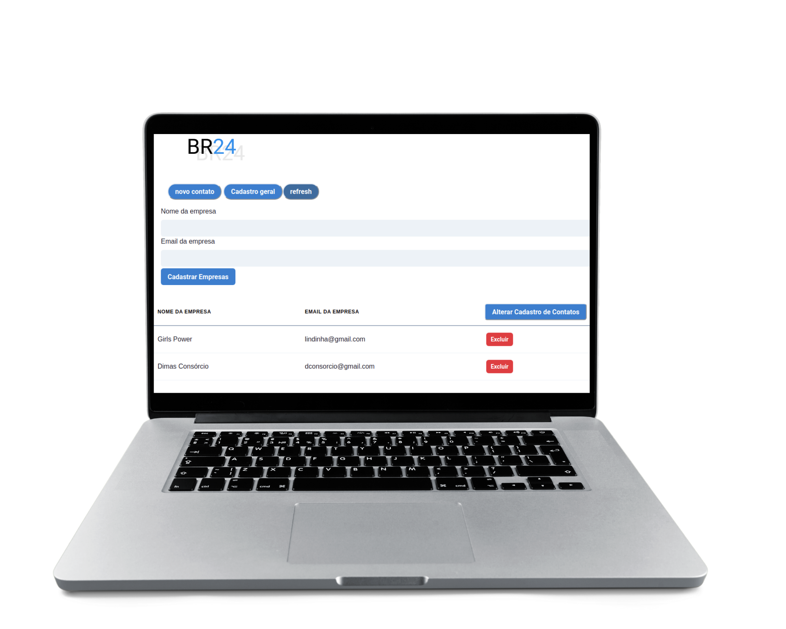
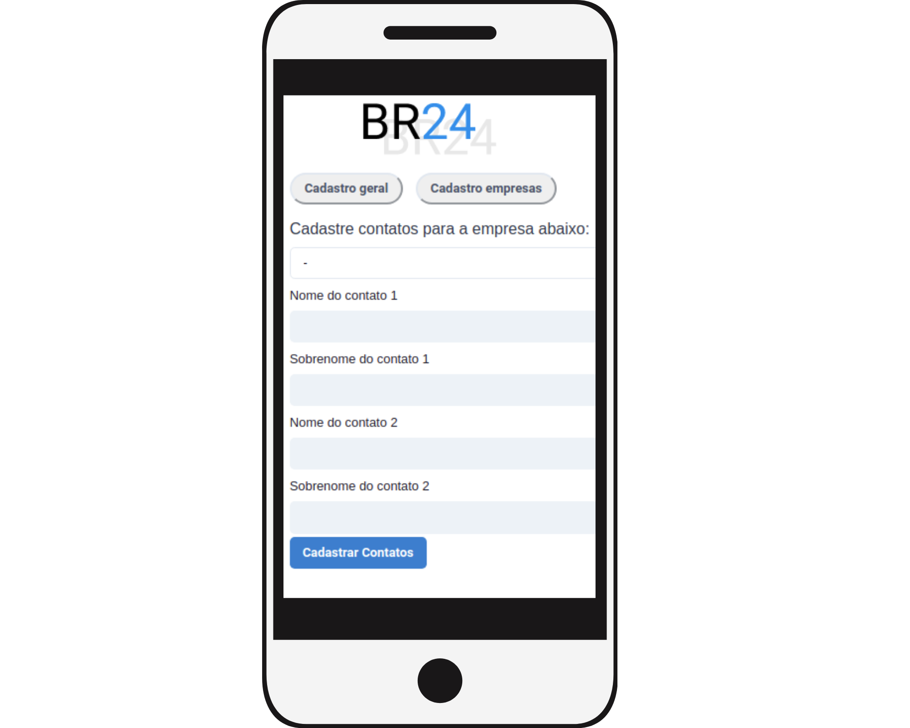
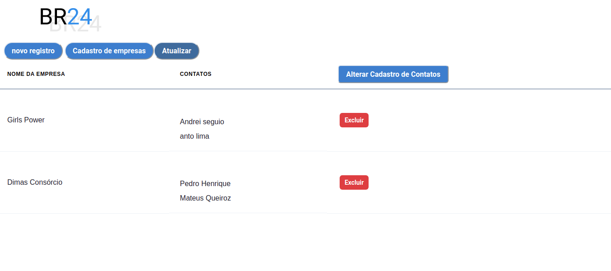
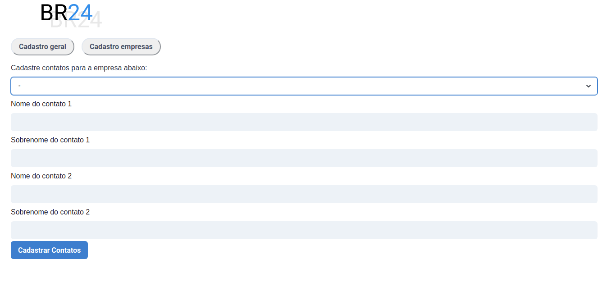
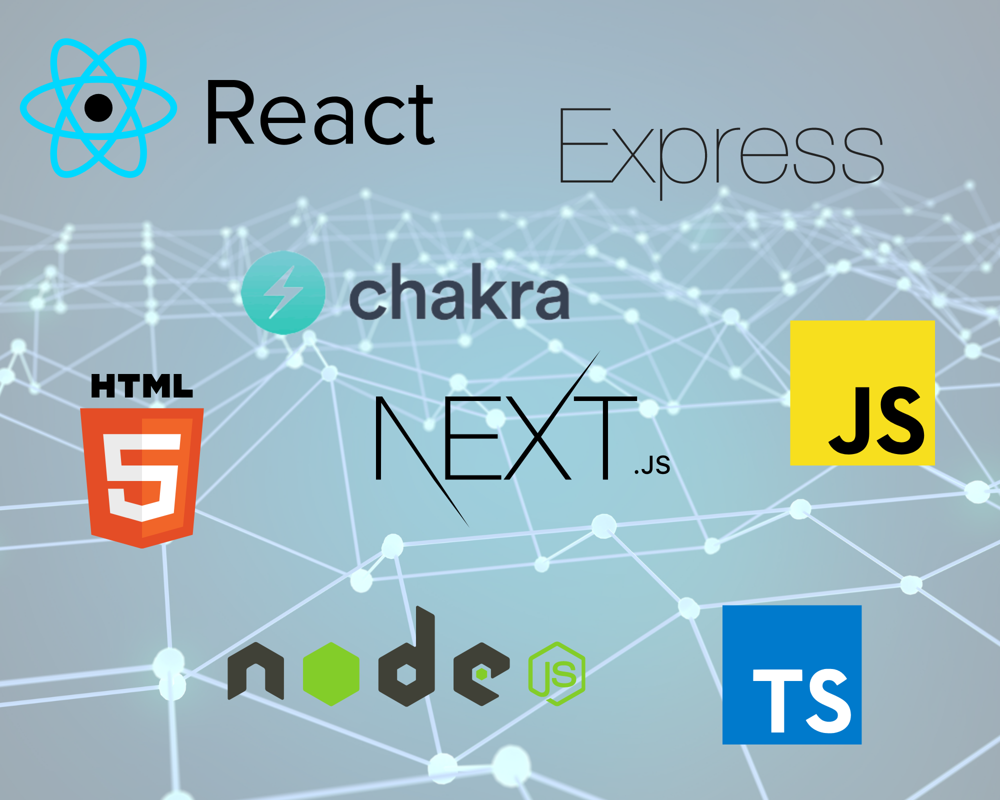

## Preview









## Tecnologias utilizadas no projeto



## Pages

- Page Index -> página inicial é a de listagem de contatos de empresas.
- Page companies -> página de listagem e cadastro de Empresas(Formulário).
- Page Cadastrar -> página onde cadastramos contatos para empresas(Formulário)

## Instalação

Clone o repositório com ```git clone https://github.com/Leojunkes/br24_desafio```

entre na pasta ```cd br24_desafio```

rode ```npm install```ou```yarn```para instalar as dependências.

e por fim rode ```yarn dev```ou ```npm run dev```

abra http://localhost:3000 com seu browser.

## Tecnologias

### FrontEnd
- React-js
- Next-js
- Chakra-ui

### BackEnd
- Node-js
- Typescript
- uuid
- Express
- ts-node-dev


